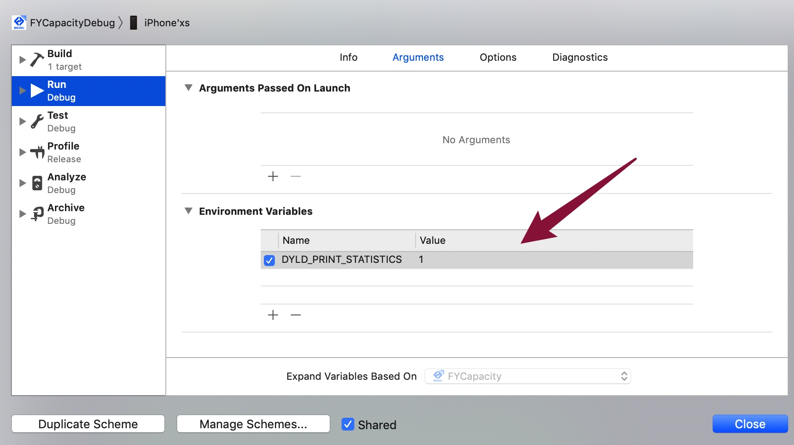

# 其他优化 (工具)


## 耗电优化

使用xcode自带工具检查Energy Impact


蓝色表示--合理,
黄色--表示程序比较耗电,
红色--表示仅仅轻度使用你的程序,就会很耗电.


影响耗电的两个大模块


1、


2、


## 启动时间优化

Xcode 中 Edit `scheme -> Run -> Auguments` 将环境变量 `DYLD_PRINT_STATISTICS` 设为 `1`




参考链接：https://www.jianshu.com/p/0858878e331f

## 内存泄漏的检查


 同耗电优化流程差不多，利用`instruments`当中的`Leaks`工具进行检查，主要检查占用`CPU`资源比较高的代码
 
 工具：利用[MLeaksFinder](https://github.com/Tencent/MLeaksFinder)主要检查引用循环的`leak`
 
 前两天腾讯新开源了一款性能优化的[Matrix-iOS](https://github.com/Tencent/matrix)工具，安卓版也有，有时间可以看下：
 
 * [Matrix-iOS 卡顿监控](https://mp.weixin.qq.com/s/gPZnR7sF_22KSsqepohgNg)
 * [Matrix-iOS 内存监控](https://mp.weixin.qq.com/s/j454cHgba6bdQECiUR22eQ)


#包体积瘦身

#### 代码检查，去除无用的类和方法（动态库等）可用`AppCode`进行检查


#### 对项目中无用图片资源进行及时清理，可用工具：`LSUnusedResources`


#### 优化引用库架构（需根据公司用户所用机型占比，由产品决定）

```
arm64：iPhone6s | iphone6s plus｜iPhone6｜ iPhone6 plus｜iPhone5S | iPad Air｜ iPad mini2(iPad mini with Retina Display)
armv7s：iPhone5｜iPhone5C｜iPad4(iPad with Retina Display)
armv7：iPhone4｜iPhone4S｜iPad｜iPad2｜iPad3(The New iPad)｜iPad mini｜iPod Touch 3G｜iPod Touch4
 
i386是针对intel通用微处理器32位处理器
x86_64是针对x86架构的64位处理器
 
模拟器32位处理器测试需要i386架构，
模拟器64位处理器测试需要x86_64架构，
真机32位处理器需要armv7,或者armv7s架构，
真机64位处理器需要arm64架构。
```


#### 优化代码，减小代码文件大小
    
* 注意方法名的长度
* 去除无用类和方法
* 对重复代码进行封装
* 相同页面尽量封装基类，由子类重写

**方案**：分析iOS可执行文件的LinkMap文件，重在统计第三方库及类文件所占体积大小


 

# 更多优化方案
 
更多优化实战：
https://github.com/skyming/iOS-Performance-Optimization

