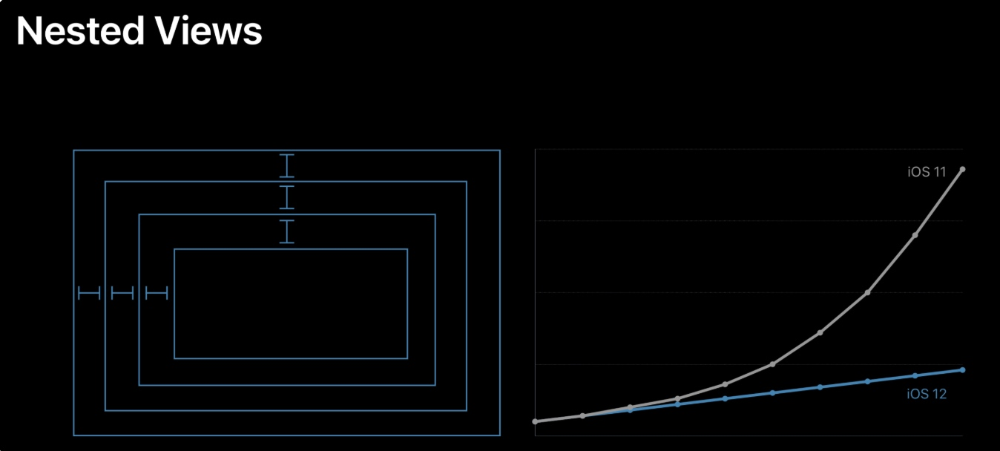

# 列表卡顿优化（代码层面）

## 屏幕显示图像的原理

通常来说，计算机系统中 CPU、GPU、显示器是以上面这种方式协同工作的。CPU 计算好显示内容提交到 GPU，GPU 渲染完成后将渲染结果放入帧缓冲区，随后视频控制器会按照 VSync 信号逐行读取帧缓冲区的数据，经过可能的数模转换传递给显示器显示。所以开发时，也需要分别对 CPU 和 GPU 压力进行评估和优化。

1、 CPU 计算显示内容提交给 GPU ，如：视图的创建、布局计算、图片解码、文本绘制
2、 GPU 渲染后将结果放入 FrameBuffer (帧缓冲区)
    FrameBuffer 中存放的是你在屏幕上看到的所有像素的颜色值和半透明值(RGBA)
3、 视频控制器按照 VSync(垂直同步信号) 读取 FrameBuffer 显示到屏幕上

## 卡顿产生的原因和解决方案


在 VSync 信号到来后，系统图形服务会通过 CADisplayLink 等机制通知 App，App 主线程开始在 CPU 中计算显示内容，比如视图的创建、布局计算、图片解码、文本绘制等。随后 CPU 会将计算好的内容提交到 GPU 去，由 GPU 进行变换、合成、渲染。随后 GPU 会把渲染结果提交到帧缓冲区去，等待下一次 VSync 信号到来时显示到屏幕上。由于垂直同步的机制，如果在一个 VSync 时间内，CPU 或者 GPU 没有完成内容提交，则那一帧就会被丢弃，等待下一次机会再显示，而这时显示屏会保留之前的内容不变。这就是界面卡顿的原因。

从上面的图中可以看到，CPU 和 GPU 不论哪个阻碍了显示流程，都会造成掉帧现象。所以开发时，也需要分别对 CPU 和 GPU 压力进行评估和优化。

## CPU 资源消耗原因和解决方案

### 对象创建

对象的创建会分配内存、调整属性、甚至还有读取文件等操作，比较消耗 CPU 资源。尽量用轻量的对象代替重量的对象，可以对性能有所优化。比如 CALayer 比 UIView 要轻量许多，那么不需要响应触摸事件的控件，用 CALayer 显示会更加合适。如果对象不涉及 UI 操作，则尽量放到后台线程去创建，但可惜的是包含有 CALayer 的控件，都只能在主线程创建和操作。通过 Storyboard 创建视图对象时，其资源消耗会比直接通过代码创建对象要大非常多，在性能敏感的界面里，Storyboard 并不是一个好的技术选择。

尽量推迟对象创建的时间，并把对象的创建分散到多个任务中去。尽管这实现起来比较麻烦，并且带来的优势并不多，但如果有能力做，还是要尽量尝试一下。如果对象可以复用，并且复用的代价比释放、创建新对象要小，那么这类对象应当尽量放到一个缓存池里复用。

问：大家知道为什么更新UI必须在主线程操作吗？

答：这是因为iOS系统中所有的UI视图相关的类都是在UIKit框架下,该框架下的所有属性都是`nonatomic`的，也就是非原子属性，即非线程安全，为了防止多线程情况下造成的线程安全问题（多个线程对同一视图进行操作），所以必须在主线程进行UI视图的更新

### 对象调整

对象的调整也经常是消耗 CPU 资源的地方。这里特别说一下 CALayer：CALayer 内部并没有属性，当调用属性方法时，它内部是通过运行时 resolveInstanceMethod 为对象临时添加一个方法，并把对应属性值保存到内部的一个 Dictionary 里，同时还会通知 delegate、创建动画等等，非常消耗资源。UIView 的关于显示相关的属性（比如 frame/bounds/transform）等实际上都是 CALayer 属性映射来的，所以对 UIView 的这些属性进行调整时，消耗的资源要远大于一般的属性。对此你在应用中，应该尽量减少不必要的属性修改。

当视图层次调整时，UIView、CALayer 之间会出现很多方法调用与通知，所以在优化性能时，应该尽量避免调整视图层次、添加和移除视图。

（其实在开发当中，我们很多的耗时操作都是基于对布局的修改，例如在UITableviewCell当中，我们应该尽量先把视图的布局写好，然后根据数据变化，修改某一个布局，避免重写所有布局）

### 对象销毁

对象的销毁虽然消耗资源不多，但累积起来也是不容忽视的。通常当容器类持有大量对象时，其销毁时的资源消耗就非常明显。同样的，如果对象可以放到后台线程去释放，那就挪到后台线程去。这里有个小 Tip：把对象捕获到 block 中，然后扔到后台队列去随便发送个消息以避免编译器警告，就可以让对象在后台线程销毁了。


```
NSArray *tmp = self.array;
self.array = nil;
dispatch_async(queue, ^{
    [tmp class];
});
```

### 布局计算

视图布局的计算是 App 中最为常见的消耗 CPU 资源的地方。如果能在后台线程提前计算好视图布局、并且对视图布局进行缓存，那么这个地方基本就不会产生性能问题了。

不论通过何种技术对视图进行布局，其最终都会落到对 UIView.frame/bounds/center 等属性的调整上。上面也说过，对这些属性的调整非常消耗资源，所以尽量提前计算好布局，在需要时一次性调整好对应属性，而不要多次、频繁的计算和调整这些属性。

### Autolayout

Autolayout 是苹果本身提倡的技术，在大部分情况下也能很好的提升开发效率，但是 Autolayout 对于复杂视图来说常常会产生严重的性能问题。随着视图数量的增长，Autolayout 带来的 CPU 消耗会呈指数级上升。具体数据可以看这个文章：http://pilky.me/36/。 如果你不想手动调整 frame 等属性，你可以用一些工具方法替代（比如常见的 left/right/top/bottom/width/height 快捷属性），或者使用 ComponentKit、AsyncDisplayKit 等框架。

AutoLayout存在的问题



注意：在iOS12操作系统中，苹果已经对复杂视图的自动布局进行优化，并不会造成CPU消耗呈指数级增长

详见：https://time.geekbang.org/column/article/85332

### 文本计算

如果一个界面中包含大量文本（比如微博微信朋友圈等），文本的宽高计算会占用很大一部分资源，并且不可避免。如果你对文本显示没有特殊要求，可以参考下 UILabel 内部的实现方式：用` [NSAttributedString boundingRectWithSize:options:context:] `来计算文本宽高，用 `-[NSAttributedString drawWithRect:options:context:] `来绘制文本。尽管这两个方法性能不错，但仍旧需要放到后台线程进行以避免阻塞主线程。

如果你用 CoreText 绘制文本，那就可以先生成 CoreText 排版对象，然后自己计算了，并且 CoreText 对象还能保留以供稍后绘制使用。

### 文本渲染

屏幕上能看到的所有文本内容控件，包括 UIWebView，在底层都是通过 CoreText 排版、绘制为 Bitmap 显示的。常见的文本控件 （UILabel、UITextView 等），其排版和绘制都是在主线程进行的，当显示大量文本时，CPU 的压力会非常大。对此解决方案只有一个，那就是自定义文本控件，用 TextKit 或最底层的 CoreText 对文本异步绘制。尽管这实现起来非常麻烦，但其带来的优势也非常大，CoreText 对象创建好后，能直接获取文本的宽高等信息，避免了多次计算（调整 UILabel 大小时算一遍、UILabel 绘制时内部再算一遍）；CoreText 对象占用内存较少，可以缓存下来以备稍后多次渲染。

### 图片的解码

当你用 UIImage 或 CGImageSource 的那几个方法创建图片时，图片数据并不会立刻解码。图片设置到 UIImageView 或者 CALayer.contents 中去，并且 CALayer 被提交到 GPU 前，CGImage 中的数据才会得到解码。这一步是发生在主线程的，并且不可避免。如果想要绕开这个机制，常见的做法是在后台线程先把图片绘制到 CGBitmapContext 中，然后从 Bitmap 直接创建图片。目前常见的网络图片库都自带这个功能。

[雷纯锋谈谈 iOS 中图片的解压缩](http://blog.leichunfeng.com/blog/2017/02/20/talking-about-the-decompression-of-the-image-in-ios/)

### 图像的绘制

图像的绘制通常是指用那些以 CG 开头的方法把图像绘制到画布中，然后从画布创建图片并显示这样一个过程。这个最常见的地方就是 [UIView drawRect:] 里面了。由于 CoreGraphic 方法通常都是线程安全的，所以图像的绘制可以很容易的放到后台线程进行。一个简单异步绘制的过程大致如下（实际情况会比这个复杂得多，但原理基本一致）：


```
- (void)display {
    dispatch_async(backgroundQueue, ^{
        CGContextRef ctx = CGBitmapContextCreate(...);
        // draw in context...
        CGImageRef img = CGBitmapContextCreateImage(ctx);
        CFRelease(ctx);
        dispatch_async(mainQueue, ^{
            layer.contents = img;
        });
    });
}
```

## GPU 资源消耗原因和解决方案

相对于 CPU 来说，GPU 能干的事情比较单一：接收提交的纹理（Texture）和顶点描述（三角形），应用变换（transform）、混合并渲染，然后输出到屏幕上。通常你所能看到的内容，主要也就是纹理（图片）和形状（三角模拟的矢量图形）两类。

### 纹理的渲染

所有的 Bitmap，包括图片、文本、栅格化的内容，最终都要由内存提交到显存，绑定为 GPU Texture。不论是提交到显存的过程，还是 GPU 调整和渲染 Texture 的过程，都要消耗不少 GPU 资源。当在较短时间显示大量图片时（比如 TableView 存在非常多的图片并且快速滑动时），CPU 占用率很低，GPU 占用非常高，界面仍然会掉帧。避免这种情况的方法只能是尽量减少在短时间内大量图片的显示，尽可能将多张图片合成为一张进行显示。

当图片过大，超过 GPU 的最大纹理尺寸时，图片需要先由 CPU 进行预处理，这对 CPU 和 GPU 都会带来额外的资源消耗。目前来说，iPhone 4S 以上机型，纹理尺寸上限都是 4096×4096，更详细的资料可以看这里：iosres.com。所以，尽量不要让图片和视图的大小超过这个值。

### 视图的混合 (Composing)

当多个视图（或者说 CALayer）重叠在一起显示时，GPU 会首先把他们混合到一起。如果视图结构过于复杂，混合的过程也会消耗很多 GPU 资源。为了减轻这种情况的 GPU 消耗，应用应当尽量减少视图数量和层次，并在不透明的视图里标明 opaque 属性以避免无用的 Alpha 通道合成。当然，这也可以用上面的方法，把多个视图预先渲染为一张图片来显示。

### 图形的生成。

CALayer 的 border、圆角、阴影、遮罩（mask），CASharpLayer 的矢量图形显示，通常会触发离屏渲染（offscreen rendering），而离屏渲染通常发生在 GPU 中。当一个列表视图中出现大量圆角的 CALayer，并且快速滑动时，可以观察到 GPU 资源已经占满，而 CPU 资源消耗很少。这时界面仍然能正常滑动，但平均帧数会降到很低。为了避免这种情况，可以尝试开启 CALayer.shouldRasterize 属性，但这会把原本离屏渲染的操作转嫁到 CPU 上去。对于只需要圆角的某些场合，也可以用一张已经绘制好的圆角图片覆盖到原本视图上面来模拟相同的视觉效果。最彻底的解决办法，就是把需要显示的图形在后台线程绘制为图片，避免使用圆角、阴影、遮罩等属性。

##### 离屏渲染

* border、圆角、阴影、遮罩(mask) 触发离屏渲染
* 另外开辟一块缓冲区(OffScreenBuffer)来做渲染的操作
* CALayer.shouldRasterize 光栅化，将离渲染的结果保存为位图(bitmap)存储起来复用，从而减少离屏渲染的次数

#### 为什么要避免离屏渲染

###### 离屏渲染的过程

`RunLoop`有一个`60fps`的回调，即每`16.7ms`绘制一次屏幕，所以view的绘制必须在这个时间内完成，view内容的绘制是`CPU`的工作，然后把绘制的内容交给`GPU`渲染，包括多个`View`的拼接（Compositing）、纹理的渲染(Texture)等等，最后显示在屏幕上。但是，如果无法是`16.7ms`内完成绘制，就会出现丢帧的问题，一般情况下，如果帧率保证在`30fps`以上，界面卡顿效果不明显，那么就需要在`33.4ms`内完成`View`的绘制，而低于这个帧率，就会产生卡顿的效果，影响体验。

离屏渲染之所以会特别消耗性能，是因为要创建一个屏幕外的缓冲区，然后从当屏缓冲区切换到屏幕外的缓冲区，然后再完成渲染；其中，创建缓冲区和切换上下文最消耗性能，而绘制其实不是性能损耗的主要原因。

###### GPU 平时要做的

* 在 frameBuffer 里渲染好需要显示的内容


###### GPU 在离屏渲染时要做的

* 从 frameBuffer 跑到 OffScreenBuffer 渲染好离屏部分内容
* 将 OffScreenBuffer 中的内容合并到 frameBuffer

###### 离屏幕渲染时需要更多的操作
* 开辟了新的缓冲区 OffScreenBuffer
* 渲染内容的合并
* 2 次昂贵的环境切换

###### 设置了以下属性时，就会触发离屏绘制：
* shouldRasterize（光栅化）
* masks（遮罩）
* shadows（阴影）
* edge antialiasing（抗锯齿）
* group opacity（不透明）
* 复杂形状设置圆角等
* 渐变

### 异步绘制存在的问题（可忽略）

当 TableView 快速滑动时，会有大量异步绘制任务提交到后台线程去执行。但是有时滑动速度过快时，绘制任务还没有完成就可能已经被取消了。如果这时仍然继续绘制，就会造成大量的 CPU 资源浪费，甚至阻塞线程并造成后续的绘制任务迟迟无法完成。我的做法是尽量快速、提前判断当前绘制任务是否已经被取消；在绘制每一行文本前，我都会调用 isCancelled() 来进行判断，保证被取消的任务能及时退出，不至于影响后续操作。(参见：https://github.com/ibireme/YYKit)

目前有些第三方微博客户端（比如 VVebo、墨客等），使用了一种方式来避免高速滑动时 Cell 的绘制过程，相关实现见这个项目：[VVeboTableViewDemo](https://github.com/johnil/VVeboTableViewDemo)。它的原理是，当滑动时，松开手指后，立刻计算出滑动停止时 Cell 的位置，并预先绘制那个位置附近的几个 Cell，而忽略当前滑动中的 Cell。这个方法比较有技巧性，并且对于滑动性能来说提升也很大，唯一的缺点就是快速滑动中会出现大量空白内容。如果你不想实现比较麻烦的异步绘制但又想保证滑动的流畅性，这个技巧是个不错的选择。


## 总结


代码分析：https://github.com/johnil/VVeboTableViewDemo

